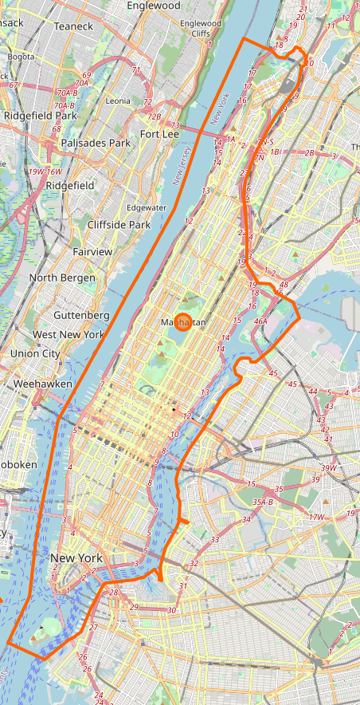

# ML Group project:

## Members:

- Mark Ditchburn
- Andrea Butera
- Kuno de Leeuw-Kent (shortened to "Kuno.DLK" )
  
## Dataset:

The dataset selected is data on all listing activity and metrics in NYC, NY for Airbnb captured for the year 2019.

The dataset can be found [here](https://www.kaggle.com/datasets/dgomonov/new-york-city-airbnb-open-data), with the provider of the data [here](https://insideairbnb.com/).


### Data Summary:

```txt
'data.frame':   48895 obs. of  16 variables:
 $ id                            : int  2539 2595 3647 3831 5022 5099 5121 5178 5203 5238 ...
 $ name                          : chr  "Clean & quiet apt home by the park" "Skylit Midtown Castle" "THE VILLAGE OF HARLEM....NEW YORK !" "Cozy Entire Floor of Brownstone" ...
 $ host_id                       : int  2787 2845 4632 4869 7192 7322 7356 8967 7490 7549 ...
 $ host_name                     : chr  "John" "Jennifer" "Elisabeth" "LisaRoxanne" ...
 $ neighbourhood_group           : chr  "Brooklyn" "Manhattan" "Manhattan" "Brooklyn" ...
 $ neighbourhood                 : chr  "Kensington" "Midtown" "Harlem" "Clinton Hill" ...
 $ latitude                      : num  40.6 40.8 40.8 40.7 40.8 ...
 $ longitude                     : num  -74 -74 -73.9 -74 -73.9 ...
 $ room_type                     : chr  "Private room" "Entire home/apt" "Private room" "Entire home/apt" ...
 $ price                         : int  149 225 150 89 80 200 60 79 79 150 ...
 $ minimum_nights                : int  1 1 3 1 10 3 45 2 2 1 ...
 $ number_of_reviews             : int  9 45 0 270 9 74 49 430 118 160 ...
 $ last_review                   : chr  "2018-10-19" "2019-05-21" "" "2019-07-05" ...
 $ reviews_per_month             : num  0.21 0.38 NA 4.64 0.1 0.59 0.4 3.47 0.99 1.33 ...
 $ calculated_host_listings_count: int  6 2 1 1 1 1 1 1 1 4 ...
 $ availability_365              : int  365 355 365 194 0 129 0 220 0 188 ...
```

### Data Visualisation:

Here is a sample of the data filtered by Manhattan plotted base on location and coloured by price. As you can see the data lines up with the map correctly and is very dense. This is most likely due to the dense population and the high amount of tourism in Manhattan and new york as a whole

<div style="display: flex;">
  
  
</div>

<div style="page-break-after: always;"></div>

## Model Aims:
For our group project we want to create a prediction model that will predict the price of a give property. These will be regression models and we will explore 3 different approaches and evaluate the accuracy of each.

To ensure each model is comparable we will be using the same seed for separating our data into training and testing subsets with 70% our data used for training and the remaining 30% for evaluating the model. 

Here is the script we use to load and separate our data, we use random separation to protect against there being changes in the data overtime:

```R
# Import CSV file
AirbnbData <- read.csv("DataSet/AB_NYC_2019.csv")

# Create Train and Test subsets
set.seed(25)
train_indices <- sample(seq_len(nrow(AirbnbData)), size = 0.7 * nrow(AirbnbData))

training <- AirbnbData[train_indices, ]
testing <- AirbnbData[-train_indices, ]
```

This has separated our data in to 34226 row for training and 14669 rows for testing 

# Models:

## Contents:

- SVM (by Andrea Butera)
- xxx (by Mark Ditchburn)
- Deep Leaning (by Kuno.DLK)

## SVM:

## XXX:

## Deep Learning:

### Data Preparation

#### Introduction
For this study, we utilized the popular `keras` library, which offers a high-level interface for building, training, and deploying deep learning models. Keras operates on top of TensorFlow, allowing for efficient and scalable backend operations. This library was chosen due to its flexibility, extensive documentation, and widespread adoption in the deep learning community. The data preparation process focused on standardizing the input features to ensure optimal model performance and minimizing potential biases.

#### Location Data
The dataset included location-specific information for rentable properties. This was represented using four columns:

| Column                | Data Description                                                                 | Example                                |
|-----------------------|----------------------------------------------------------------------------------|----------------------------------------|
| `neighbourhood_group` | A categorical string representing the high-level geographic grouping (e.g., "Brooklyn"). | "Brooklyn", "Manhattan", "Manhattan"... |
| `neighbourhood`       | A categorical string indicating the specific neighborhood (e.g., "Kensington"). | "Kensington", "Midtown", "Harlem"...   |
| `latitude`            | A numerical value representing the latitude coordinate of the property.         | 40.6, 40.8, 40.8, 40.7, 40.8...        |
| `longitude`           | A numerical value representing the longitude coordinate of the property.        | -74, -74, -73.9, -74, -73.9...         |


#### Feature Selection
To streamline the model and improve efficiency,the `neighbourhood` and `neighbourhood_group` columns were removed. These categorical features were deemed redundant given the availability of precise latitude and longitude coordinates. Latitude and longitude provide sufficient granularity to describe a property’s location accurately.

However, using raw latitude and longitude coordinates presented challenges. The values had significant offsets (approximately 40 for latitude and -74 for longitude), which could hinder model convergence due to their large magnitude differences relative to other features.

#### Normalization
To address the disparity in magnitude, the latitude and longitude values were normalized to fall within a range of 0 to 1. This normalization process was performed as follows:
- The minimum value of each coordinate was subtracted from the raw value.
- The result was divided by the range (maximum value minus minimum value) for that coordinate.

This transformation ensured that the westernmost location was represented as `0`, and the easternmost location was represented as `1`. While normalization improved model usability, it did not yield sufficient accuracy. The testing error remained approximately 10%, primarily due to the insufficient granularity of the normalized values.

#### Challenges with Normalized Inputs
A key limitation of using normalized latitude and longitude values as inputs was their inability to capture fine-grained locational differences. For instance, entire city blocks were represented by differences in normalized values on the order of ~0.0005. Such small differences were not prominent enough for the model to distinguish between adjacent locations effectively, leading to suboptimal predictions.

#### Solution: Binary Encoding
To overcome this limitation, binary encoding was employed as a preprocessing step for the location data. The normalized latitude and longitude values were multiplied by \(2^{16}\) (i.e., 65,536) to convert them into discrete integer values. These integers were then represented as 16-bit binary values.

This approach provided several advantages:
1. **Increased Granularity:** Each bit in the binary representation corresponded to a discrete geographical area. With 16 bits for both latitude and longitude, the map was divided into approximately \(65,536 \times 65,536\) cells (~4.2 billion squares).
2. **Feature Relevance:** The most significant bits captured coarse locational features (e.g., east vs. west), while less significant bits captured finer locational details.
3. **Model Interpretability:** Each input feature (bit) had a clear spatial interpretation, making it easier for the model to learn locational patterns.

For example:
- The most significant bit of the longitude indicated whether a property was located on the western or eastern half of the dataset.
- Subsequent bits progressively divided the map into smaller regions, enabling precise locational differentiation.

This binary encoding strategy significantly improved model accuracy by providing a more expressive representation of location data.

