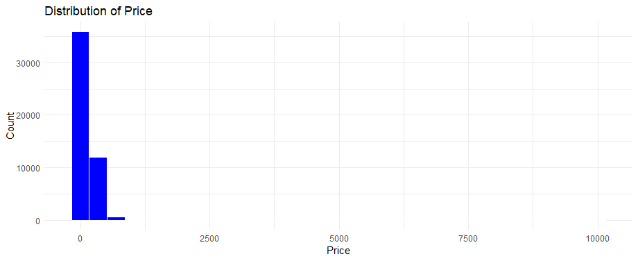
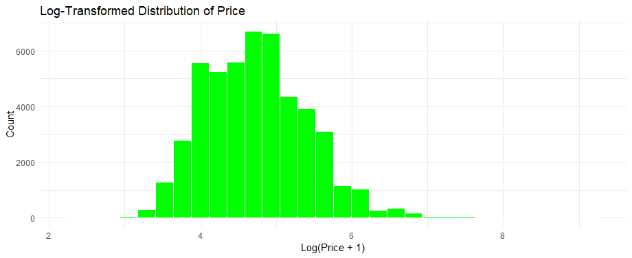
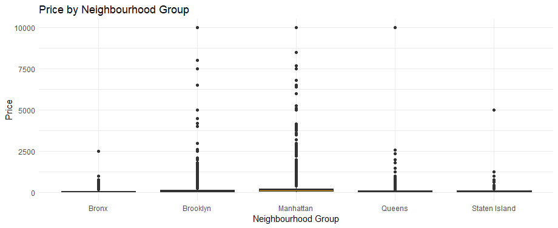
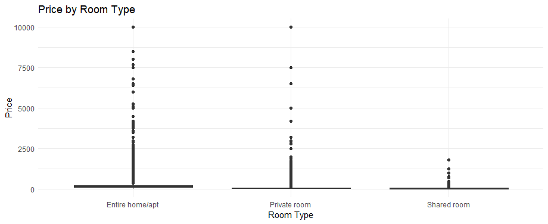
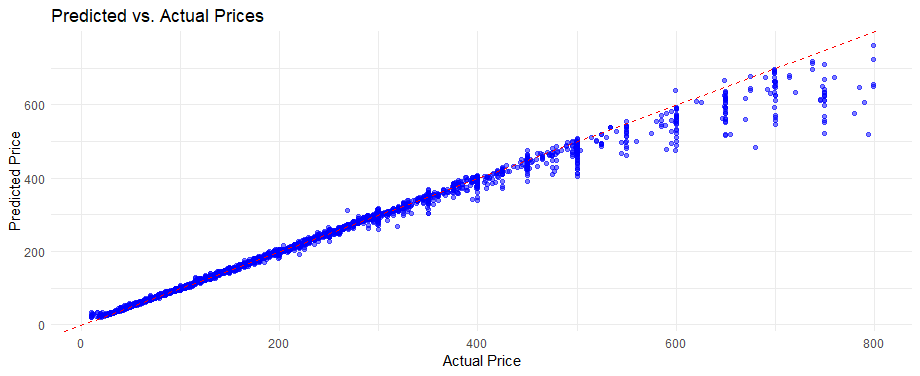
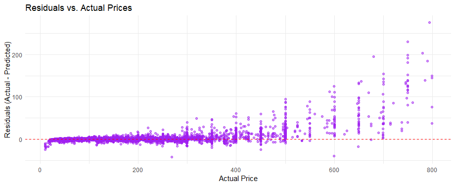
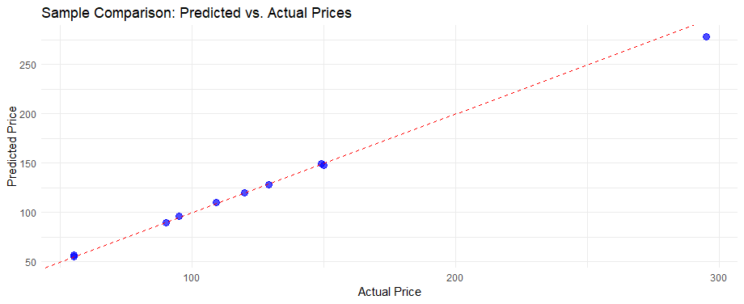

# ML Group project:

# Example MD Syntax (To Be removed)

This is how you add code:
```r
# ========================= Import the data from CSV=============================

# Import CSV file
AirbnbData <- read.csv("DataSet/AB_NYC_2019.csv")

# ===============================================================================
```

This is how your add images:


This is how you add [links](https://www.youtube.com/watch?v=dQw4w9WgXcQ):


## SVM (by Andrea Butera)
## Random Forest (by Mark Ditchburn C2932952)
### Summary:
- Data is processed and used to trained a Random Forest Model
- Determined key factors in price determination
- Model is accurate to an R2 of 99.7%

## R Script
```r
#--------------------Data Clean-------------------------------------------

# Load necessary libraries
library(tidyverse)  # For data manipulation and visualization

# Load the dataset
airbnb_data <- read.csv("AB_NYC_2019.csv")

# Inspect the data structure and basic statistics
str(airbnb_data)       # Check structure of the dataset
summary(airbnb_data)   # Summary statistics of the dataset
head(airbnb_data)      # Preview the first few rows
```

```r
# Count rows with missing or zero price before filtering is applied
rows_with_missing_or_zero_price <- airbnb_data %>%
  filter(is.na(price) | price == 0) %>%
  nrow()
cat("Rows with missing or zero price (before filtering):", rows_with_missing_or_zero_price, "\n")

# Remove rows where price is missing or 0
airbnb_data <- airbnb_data %>%
  filter(!is.na(price) & price > 0)

# Count rows with missing or zero price after filtering
rows_with_missing_or_zero_price_after <- airbnb_data %>%
  filter(is.na(price) | price == 0) %>%
  nrow()
cat("Rows with missing or zero price (after filtering):", rows_with_missing_or_zero_price_after, "\n")

# Confirm the cleaned dataset
summary(airbnb_data)

# Remove unnecessary columns (latitude and longitude)
# These are not required for modeling in the current analysis
airbnb_data <- airbnb_data %>%
  select(neighbourhood_group, neighbourhood, room_type, price, minimum_nights, 
         number_of_reviews, reviews_per_month, calculated_host_listings_count, availability_365)

# Confirm changes to the dataset
glimpse(airbnb_data)

# Check for missing values in numeric columns
numeric_cols <- sapply(airbnb_data, is.numeric)
missing_counts <- colSums(is.na(airbnb_data[, numeric_cols]))

# Print columns with missing values (if any)
print(missing_counts[missing_counts > 0])

# Impute missing values in reviews_per_month with 0
airbnb_data$reviews_per_month[is.na(airbnb_data$reviews_per_month)] <- 0

# Confirm no missing values remain
colSums(is.na(airbnb_data))

# Save the cleaned dataset to a new CSV file for reproducibility
write.csv(airbnb_data, "cleaned_AB_NYC_2019.csv", row.names = FALSE)

#-------------------------------Exploratory Data Analysis-----------------------

# Reload the cleaned dataset for analysis continuity
airbnb_data <- read.csv("cleaned_AB_NYC_2019.csv")

# Inspect structure and summary
str(airbnb_data)
summary(airbnb_data)

# Histogram of price distribution
ggplot(airbnb_data, aes(x = price)) +
  geom_histogram(bins = 30, fill = "blue", color = "white") +
  theme_minimal() +
  labs(title = "Distribution of Price", x = "Price", y = "Count")
```

```r
# Log-transform price to handle skewness
ggplot(airbnb_data, aes(x = log1p(price))) +
  geom_histogram(bins = 30, fill = "green", color = "white") +
  theme_minimal() +
  labs(title = "Log-Transformed Distribution of Price", x = "Log(Price + 1)", y = "Count")

# Add a new column for log-transformed price
airbnb_data$log_price <- log1p(airbnb_data$price)
```

```r
# Boxplot of price by neighbourhood_group
ggplot(airbnb_data, aes(x = neighbourhood_group, y = price)) +
  geom_boxplot(fill = "orange") +
  theme_minimal() +
  labs(title = "Price by Neighbourhood Group", x = "Neighbourhood Group", y = "Price")
```

```r
# Boxplot of price by room_type
ggplot(airbnb_data, aes(x = room_type, y = price)) +
  geom_boxplot(fill = "purple") +
  theme_minimal() +
  labs(title = "Price by Room Type", x = "Room Type", y = "Price")
```

```r
#--------------------Prepare Data for Model-------------------------------------

# Label encode categorical variables for modeling
airbnb_data$neighbourhood_group <- as.numeric(as.factor(airbnb_data$neighbourhood_group))
airbnb_data$room_type <- as.numeric(as.factor(airbnb_data$room_type))

# Filter out extreme prices (top 1% to handle outliers)
price_threshold <- quantile(airbnb_data$price, 0.99)  # 99th percentile
airbnb_data <- airbnb_data %>%
  filter(price <= price_threshold)

# Recalculate log_price after filtering
airbnb_data$log_price <- log1p(airbnb_data$price)

# Split the data into training (70%) and testing (30%) sets
set.seed(123)  # For reproducibility
train_index <- sample(1:nrow(airbnb_data), size = 0.7 * nrow(airbnb_data))
train_data <- airbnb_data[train_index, ]
test_data <- airbnb_data[-train_index, ]

#----------------------Train and Evaluate the Model---------------------------------------

# Install and load necessary libraries
install.packages("Metrics")
install.packages("randomForest")
library(Metrics)
library(randomForest)

# Train the random forest model
rf_model <- randomForest(log_price ~ ., data = train_data, importance = TRUE, ntree = 100)

# Print the model summary
print(rf_model)

# Predict on the test set
test_predictions <- predict(rf_model, test_data)

# Calculate RMSE and R²
rmse_value <- rmse(test_data$log_price, test_predictions)
cat("RMSE:", rmse_value, "\n")

r2_value <- cor(test_data$log_price, test_predictions)^2
cat("R²:", r2_value, "\n")

# Feature importance visualization
varImpPlot(rf_model)

#----------------------Visualize Predictions---------------------------------------

# Back-transform log_price predictions to actual price scale
test_actual_price <- exp(test_data$log_price) - 1
test_predicted_price <- exp(test_predictions) - 1

# Scatter plot of predicted vs. actual prices
comparison_df <- data.frame(Actual = test_actual_price, Predicted = test_predicted_price)

ggplot(comparison_df, aes(x = Actual, y = Predicted)) +
  geom_point(alpha = 0.5, color = "blue") +
  geom_abline(intercept = 0, slope = 1, color = "red", linetype = "dashed") +
  theme_minimal() +
  labs(title = "Predicted vs. Actual Prices", x = "Actual Price", y = "Predicted Price")
```

```r
# Residual plot to visualize prediction errors
residuals <- test_actual_price - test_predicted_price

ggplot(data.frame(Actual = test_actual_price, Residuals = residuals), aes(x = Actual, y = Residuals)) +
  geom_point(alpha = 0.5, color = "purple") +
  geom_hline(yintercept = 0, color = "red", linetype = "dashed") +
  theme_minimal() +
  labs(title = "Residuals vs. Actual Prices", x = "Actual Price", y = "Residuals (Actual - Predicted)")
```

```r
# Combine into a data frame
comparison_df <- data.frame(
  Actual_Price = test_actual_price,
  Predicted_Price = test_predicted_price
)

# Sample 10 random rows for the table
set.seed(123)
sample_comparison <- comparison_df[sample(1:nrow(comparison_df), 10), ]

# Print table
print(sample_comparison)

ggplot(sample_comparison, aes(x = Actual_Price, y = Predicted_Price)) +
  geom_point(alpha = 0.7, color = "blue", size = 3) +
  geom_abline(intercept = 0, slope = 1, color = "red", linetype = "dashed") +
  theme_minimal() +
  labs(
    title = "Sample Comparison: Predicted vs. Actual Prices",
    x = "Actual Price",
    y = "Predicted Price"
  )
```

## Deep Leaning (by Kuno.DLK):

### Summary:

- Successfully setup and trained a Neural Net model.
- Model is accurate to a average accuracy of 94%
- Model is using the whole dataset.

## Output Plot:


### Script:
```R
# ========================= Import the data from CSV=============================

# Import CSV file
AirbnbData <- read.csv("DataSet/AB_NYC_2019.csv")

str(AirbnbData)


# ===============================================================================

# ================== This is for running on whole dataset =======================

# Create Train and Test subsets
set.seed(25)
train_indices <- sample(seq_len(nrow(AirbnbData)), size = 0.7 * nrow(AirbnbData))

training_full <- AirbnbData[train_indices, ]
testing_full <- AirbnbData[-train_indices, ]

# ===============================================================================

# =========== This will create a smaller set for faster testing of code =========

# Create Train and Test subsets
set.seed(25)

training_small <- AirbnbData[sample(seq_len(nrow(AirbnbData)), size = 700), ]
testing_small <- AirbnbData[sample(seq_len(nrow(AirbnbData)), size = 300), ]

# ===============================================================================

# ============================ Set the datasets to use  =========================

# uncomment for small
#training <- training_small
#testing <- testing_small

# uncomment for full
training <- training_full
testing <- testing_full

# ===============================================================================

# ======================== Install Any Required Packages ========================

#install.packages("caret")

# ===============================================================================


# Load libraries
library(keras)
library(deepnet)
library(caret)

# ================================ Format The Data ==============================


# Select only necessary columns
features <- c("latitude", "longitude", "room_type", "minimum_nights", "number_of_reviews", "availability_365")

training_set <- training[, c(features, "price")]
testing_set <- testing[, c(features, "price")]

# Check and handle missing values
training_set <- na.omit(training_set)
testing_set <- na.omit(testing_set)

# Filter for items with a price under 1000
training_set <- training_set[training_set$price < 1000, ]
testing_set <- testing_set[testing_set$price < 1000, ]

# Verify the dimensions and structure after cleanup
print(dim(training_set))
print(str(training_set))
print(dim(testing_set))
print(str(testing_set))

# ===============================================================================

# ================================ Encoding ================================================

library(keras)


# Normalizing numerical variables
normalize <- function(x) {
  return((x - min(x)) / (max(x) - min(x)))
}

training_set$latitude <- normalize(training_set$latitude)
training_set$longitude <- normalize(training_set$longitude)
testing_set$latitude <- normalize(testing_set$latitude)
testing_set$longitude <- normalize(testing_set$longitude)

# Normalize target variable with the same method
price_min <- min(training_set$price)
price_max <- max(training_set$price)

# Normalize the price based on the training set min/max
training_set$price <- (training_set$price - price_min) / (price_max - price_min)
testing_set$price <- (testing_set$price - price_min) / (price_max - price_min)

print(dim(training_set))
print(str(training_set))
print(dim(testing_set))
print(str(testing_set))

# =================================================================================================


# ================================ Binary Encoding ================================================

# Function to convert a normalized value (0-1) to a 16-bit binary vector
normalized_to_binary_vector <- function(value) {
  # Ensure the value is within the normalized range of 0 to 1
  if (value < 0 || value > 1) {
    stop("Value must be between 0 and 1")
  }
  
  # Scale the value to a 16-bit integer
  int_value <- as.integer(value * 65535)
  
  # Convert the integer to a binary string
  binary_string <- intToBits(int_value)[1:16] # Extract the first 16 bits
  
  # Convert the binary string to a numeric vector (0s and 1s)
  binary_vector <- as.numeric(rev(binary_string)) # Reverse the bits to get the correct order
  
  return(binary_vector)
}

# Apply the binary encoding to latitude and longitude for both training and testing sets
training_lat_binary <- t(apply(as.matrix(training_set$latitude), 1, normalized_to_binary_vector))
training_long_binary <- t(apply(as.matrix(training_set$longitude), 1, normalized_to_binary_vector))

testing_lat_binary <- t(apply(as.matrix(testing_set$latitude), 1, normalized_to_binary_vector))
testing_long_binary <- t(apply(as.matrix(testing_set$longitude), 1, normalized_to_binary_vector))

# =================================================================================================

# ================================ Encoding Additional Features ===============================

# Normalize numerical variables
training_set$minimum_nights <- normalize(training_set$minimum_nights)
training_set$number_of_reviews <- normalize(training_set$number_of_reviews)
training_set$availability_365 <- normalize(training_set$availability_365)

testing_set$minimum_nights <- normalize(testing_set$minimum_nights)
testing_set$number_of_reviews <- normalize(testing_set$number_of_reviews)
testing_set$availability_365 <- normalize(testing_set$availability_365)

print(str(training_set))

# One-hot encode the room_type feature using model.matrix
# This automatically creates dummy variables for each category
training_room_type_one_hot <- model.matrix(~ room_type - 1, data = training_set)  # `-1` removes the intercept
head(training_room_type_one_hot)
testing_room_type_one_hot <- model.matrix(~ room_type - 1, data = testing_set)

# Binary encode normalized numerical features (minimum_nights, number_of_reviews, availability_365)
training_min_nights_binary <- t(apply(as.matrix(training_set$minimum_nights), 1, normalized_to_binary_vector))
head(training_min_nights_binary)
training_num_reviews_binary <- t(apply(as.matrix(training_set$number_of_reviews), 1, normalized_to_binary_vector))
head(training_num_reviews_binary)
training_avail_binary <- t(apply(as.matrix(training_set$availability_365), 1, normalized_to_binary_vector))
head(training_num_reviews_binary)
testing_min_nights_binary <- t(apply(as.matrix(testing_set$minimum_nights), 1, normalized_to_binary_vector))
testing_num_reviews_binary <- t(apply(as.matrix(testing_set$number_of_reviews), 1, normalized_to_binary_vector))
testing_avail_binary <- t(apply(as.matrix(testing_set$availability_365), 1, normalized_to_binary_vector))

# Combine all features into a single training and testing input matrix
training_inputs <- cbind(
  training_lat_binary,                 # Binary-encoded latitude
  training_long_binary,                # Binary-encoded longitude
  training_room_type_one_hot,          # One-hot encoded room type
  training_min_nights_binary,          # Binary-encoded minimum nights
  training_num_reviews_binary,         # Binary-encoded number of reviews
  training_avail_binary                # Binary-encoded availability (days per year)
)

testing_inputs <- cbind(
  testing_lat_binary,                  # Binary-encoded latitude
  testing_long_binary,                 # Binary-encoded longitude
  testing_room_type_one_hot,           # One-hot encoded room type
  testing_min_nights_binary,           # Binary-encoded minimum nights
  testing_num_reviews_binary,          # Binary-encoded number of reviews
  testing_avail_binary                 # Binary-encoded availability (days per year)
)

print(str(training_inputs))
print(str(testing_inputs))

# Update input shape in model definition to match the new input size
input_size <- ncol(training_inputs)

# Load necessary libraries
library(keras)

# Define the neural network model with updated input size
model <- keras_model_sequential() %>%
  layer_dense(units = input_size, activation = 'relu', input_shape = c(input_size)) %>%
  layer_dense(units = 512, activation = 'relu') %>%
  layer_dense(units = 512, activation = 'relu') %>%
  layer_dense(units = 1024, activation = 'relu') %>%
  layer_dense(units = 1024, activation = 'relu') %>%
  layer_dense(units = 1024, activation = 'relu') %>%
  layer_dense(units = 1024, activation = 'relu') %>%
  layer_dense(units = 512, activation = 'relu') %>%
  layer_dense(units = 512, activation = 'relu') %>%
  layer_dense(units = 1, activation = 'relu')

# Compile the model
model %>% compile(
  loss = 'mean_squared_error',
  optimizer = optimizer_adam(
    learning_rate = 0.00001 # Specify learning rate
  ),
  metrics = c('mean_absolute_error')
)

# Fit the model to the training data
history <- model %>% fit(
  training_inputs,                      # Input features (binary-encoded latitude and longitude)
  training_set$price,                   # Target variable
  epochs = 10,
  batch_size = 64,
  validation_split = 0.005
)

# Evaluate the model's performance on the testing data
evaluation <- model %>% evaluate(
  testing_inputs,                       # Input features for testing
  testing_set$price                     # Target variable for testing
)

# Print the evaluation result
print(evaluation)

# You can predict the testing set using the trained model
predictions <- model %>% predict(testing_inputs)

# Load necessary library for plotting
library(ggplot2)

# Predictions need to be denormalized to match original price scale
denormalized_predictions <- predictions * (price_max - price_min) + price_min
denormalized_test_values <- testing_set$price * (price_max - price_min) + price_min


# ================================ Output graph  ===============================================

# Load ggplot2 library
library(ggplot2)

# Assuming 'denormalized_predictions' and 'denormalized_test_values' are already calculated

# Create a data frame for plotting
plot_data <- data.frame(
  Predicted = denormalized_predictions,
  Expected = denormalized_test_values
)

# Create the scatter plot
ggplot(plot_data, aes(x = Expected, y = Predicted)) +
  geom_point(color = "blue", alpha = 0.6) + # Scatter points
  geom_abline(slope = 1, intercept = 0, color = "red", linetype = "dashed") + # y=x line
  labs(
    title = "Predicted vs Expected",
    x = "Expected (Actual Prices)",
    y = "Predicted Prices"
  ) +
  theme_minimal() # Apply a clean theme


```

## Script Output:

```txt
> source("c:\\Users\\lolli\\Documents\\Git\\Year3Semester1\\Machine Learning\\$
'data.frame':   48895 obs. of  16 variables:
 $ id                            : int  2539 2595 3647 3831 5022 5099 5121 5178 5203 5238 ...
 $ name                          : chr  "Clean & quiet apt home by the park" "Skylit Midtown Castle" "THE VILLAGE OF HARLEM....NEW YORK !" "Cozy Entire Floor of Brownstone" ...
 $ host_id                       : int  2787 2845 4632 4869 7192 7322 7356 8967 7490 7549 ...
 $ host_name                     : chr  "John" "Jennifer" "Elisabeth" "LisaRoxanne" ...
 $ neighbourhood_group           : chr  "Brooklyn" "Manhattan" "Manhattan" "Brooklyn" ...
 $ neighbourhood                 : chr  "Kensington" "Midtown" "Harlem" "Clinton Hill" ...
 $ latitude                      : num  40.6 40.8 40.8 40.7 40.8 ...
 $ longitude                     : num  -74 -74 -73.9 -74 -73.9 ...
 $ room_type                     : chr  "Private room" "Entire home/apt" "Private room" "Entire home/apt" ...
 $ price                         : int  149 225 150 89 80 200 60 79 79 150 ...
 $ minimum_nights                : int  1 1 3 1 10 3 45 2 2 1 ...
 $ number_of_reviews             : int  9 45 0 270 9 74 49 430 118 160 ...
 $ last_review                   : chr  "2018-10-19" "2019-05-21" "" "2019-07-05" ...
 $ reviews_per_month             : num  0.21 0.38 NA 4.64 0.1 0.59 0.4 3.47 0.99 1.33 ...
 $ calculated_host_listings_count: int  6 2 1 1 1 1 1 1 1 4 ...
 $ availability_365              : int  365 355 365 194 0 129 0 220 0 188 ...
Loading required package: ggplot2
Loading required package: lattice
[1] 34016     7
'data.frame':   34016 obs. of  7 variables:
 $ latitude         : num  40.8 40.8 40.9 40.8 40.7 ...
 $ longitude        : num  -74 -74 -73.9 -73.9 -73.8 ...
 $ room_type        : chr  "Shared room" "Private room" "Private room" "Private room" ...
 $ minimum_nights   : int  1 1 2 1 1 1 1 1 2 2 ...
 $ number_of_reviews: int  4 0 2 0 88 22 0 0 10 35 ...
 $ availability_365 : int  365 0 220 0 253 89 43 8 0 346 ...
 $ price            : int  75 25 80 46 89 180 185 150 110 120 ...
NULL
[1] 14581     7
'data.frame':   14581 obs. of  7 variables:
 $ latitude         : num  40.8 40.8 40.7 40.7 40.8 ...
 $ longitude        : num  -74 -73.9 -74 -74 -74 ...
 $ room_type        : chr  "Entire home/apt" "Private room" "Entire home/apt" "Entire home/apt" ...
 $ minimum_nights   : int  1 3 1 3 2 2 2 90 2 4 ...
 $ number_of_reviews: int  45 0 270 74 430 118 113 27 148 197 ...
 $ availability_365 : int  355 365 194 129 220 0 333 0 46 284 ...
 $ price            : int  225 150 89 200 79 79 85 120 140 55 ...
NULL
[1] 34016     7
'data.frame':   34016 obs. of  7 variables:
 $ latitude         : num  0.644 0.768 0.931 0.784 0.394 ...
 $ longitude        : num  0.483 0.546 0.637 0.566 0.896 ...
 $ room_type        : chr  "Shared room" "Private room" "Private room" "Private room" ...
 $ minimum_nights   : int  1 1 2 1 1 1 1 1 2 2 ...
 $ number_of_reviews: int  4 0 2 0 88 22 0 0 10 35 ...
 $ availability_365 : int  365 0 220 0 253 89 43 8 0 346 ...
 $ price            : num  0.0751 0.025 0.0801 0.046 0.0891 ...
NULL
[1] 14581     7
'data.frame':   14581 obs. of  7 variables:
 $ latitude         : num  0.608 0.745 0.438 0.593 0.636 ...
 $ longitude        : num  0.489 0.569 0.535 0.506 0.487 ...
 $ room_type        : chr  "Entire home/apt" "Private room" "Entire home/apt" "Entire home/apt" ...
 $ minimum_nights   : int  1 3 1 3 2 2 2 90 2 4 ...
 $ number_of_reviews: int  45 0 270 74 430 118 113 27 148 197 ...
 $ availability_365 : int  355 365 194 129 220 0 333 0 46 284 ...
 $ price            : num  0.2252 0.1502 0.0891 0.2002 0.0791 ...
NULL
'data.frame':   34016 obs. of  7 variables:
 $ latitude         : num  0.644 0.768 0.931 0.784 0.394 ...
 $ longitude        : num  0.483 0.546 0.637 0.566 0.896 ...
 $ room_type        : chr  "Shared room" "Private room" "Private room" "Private room" ...
 $ minimum_nights   : num  0 0 0.001 0 0 ...
 $ number_of_reviews: num  0.00636 0 0.00318 0 0.1399 ...
 $ availability_365 : num  1 0 0.603 0 0.693 ...
 $ price            : num  0.0751 0.025 0.0801 0.046 0.0891 ...
NULL
 num [1:34016, 1:83] 1 1 1 1 0 0 0 1 0 0 ...
 - attr(*, "dimnames")=List of 2
  ..$ : chr [1:34016] "45533" "22121" "18491" "23824" ...
  ..$ : chr [1:83] "" "" "" "" ...
NULL
 num [1:14581, 1:83] 1 1 0 1 1 1 1 1 0 1 ...
 - attr(*, "dimnames")=List of 2
  ..$ : chr [1:14581] "2" "3" "4" "6" ...
  ..$ : chr [1:83] "" "" "" "" ...
NULL
2025-01-04 13:32:40.624085: I tensorflow/core/util/port.cc:113] oneDNN custom operations are on. You may see slightly different numerical results due to floating-point round-off errors from different computation orders. To turn them off, set the environment variable `TF_ENABLE_ONEDNN_OPTS=0`.
WARNING:tensorflow:From C:\Users\lolli\DOCUME~1\VIRTUA~1\R-TENS~1\Lib\site-packages\keras\src\losses.py:2976: The name tf.losses.sparse_softmax_cross_entropy is deprecated. Please use tf.compat.v1.losses.sparse_softmax_cross_entropy instead.

WARNING:tensorflow:From C:\Users\lolli\DOCUME~1\VIRTUA~1\R-TENS~1\Lib\site-packages\keras\src\backend.py:873: The name tf.get_default_graph is deprecated. Please use tf.compat.v1.get_default_graph instead.

2025-01-04 13:32:44.264221: I tensorflow/core/platform/cpu_feature_guard.cc:182] This TensorFlow binary is optimized to use available CPU instructions in performance-critical operations.   
To enable the following instructions: SSE SSE2 SSE3 SSE4.1 SSE4.2 AVX2 FMA, in other operations, rebuild TensorFlow with the appropriate compiler flags.
Epoch 1/10
WARNING:tensorflow:From C:\Users\lolli\DOCUME~1\VIRTUA~1\R-TENS~1\Lib\site-packages\keras\src\utils\tf_utils.py:492: The name tf.ragged.RaggedTensorValue is deprecated. Please use tf.compat.v1.ragged.RaggedTensorValue instead.

WARNING:tensorflow:From C:\Users\lolli\DOCUME~1\VIRTUA~1\R-TENS~1\Lib\site-packages\keras\src\engine\base_layer_utils.py:384: The name tf.executing_eagerly_outside_functions is deprecated. Please use tf.compat.v1.executing_eagerly_outside_functions instead.

529/529 [==============================] - 10s 18ms/step - loss: 0.0184 - mean_absolute_error: 0.0923
529/529 [==============================] - 10s 18ms/step - loss: 0.0184 - mean_absolute_error: 0.0923 - val_loss: 0.0086 - val_mean_absolute_error: 0.0651
Epoch 2/10
529/529 [==============================] - 9s 18ms/step - loss: 0.0094 - mean_absolute_error: 0.0598
529/529 [==============================] - 9s 18ms/step - loss: 0.0094 - mean_absolute_error: 0.0598 - val_loss: 0.0084 - val_mean_absolute_error: 0.0632
Epoch 3/10
529/529 [==============================] - 9s 18ms/step - loss: 0.0089 - mean_absolute_error: 0.0578
529/529 [==============================] - 9s 18ms/step - loss: 0.0089 - mean_absolute_error: 0.0578 - val_loss: 0.0084 - val_mean_absolute_error: 0.0596
Epoch 4/10
529/529 [==============================] - 9s 17ms/step - loss: 0.0085 - mean_absolute_error: 0.0564
529/529 [==============================] - 9s 17ms/step - loss: 0.0085 - mean_absolute_error: 0.0564 - val_loss: 0.0079 - val_mean_absolute_error: 0.0584
Epoch 5/10
529/529 [==============================] - 9s 17ms/step - loss: 0.0082 - mean_absolute_error: 0.0551
529/529 [==============================] - 9s 17ms/step - loss: 0.0082 - mean_absolute_error: 0.0551 - val_loss: 0.0080 - val_mean_absolute_error: 0.0579
Epoch 6/10
529/529 [==============================] - 9s 17ms/step - loss: 0.0079 - mean_absolute_error: 0.0541
529/529 [==============================] - 9s 17ms/step - loss: 0.0079 - mean_absolute_error: 0.0541 - val_loss: 0.0081 - val_mean_absolute_error: 0.0540
Epoch 7/10
529/529 [==============================] - 9s 17ms/step - loss: 0.0076 - mean_absolute_error: 0.0533
529/529 [==============================] - 9s 17ms/step - loss: 0.0076 - mean_absolute_error: 0.0533 - val_loss: 0.0083 - val_mean_absolute_error: 0.0586
Epoch 8/10
529/529 [==============================] - 9s 17ms/step - loss: 0.0073 - mean_absolute_error: 0.0522
529/529 [==============================] - 9s 17ms/step - loss: 0.0073 - mean_absolute_error: 0.0522 - val_loss: 0.0080 - val_mean_absolute_error: 0.0551
Epoch 9/10
529/529 [==============================] - 9s 18ms/step - loss: 0.0070 - mean_absolute_error: 0.0513
529/529 [==============================] - 9s 18ms/step - loss: 0.0070 - mean_absolute_error: 0.0513 - val_loss: 0.0084 - val_mean_absolute_error: 0.0591
Epoch 10/10
529/529 [==============================] - 9s 17ms/step - loss: 0.0066 - mean_absolute_error: 0.0501
529/529 [==============================] - 9s 18ms/step - loss: 0.0066 - mean_absolute_error: 0.0501 - val_loss: 0.0091 - val_mean_absolute_error: 0.0630
456/456 [==============================] - 1s 2ms/step - loss: 0.0100 - mean_absolute_error: 0.0613
456/456 [==============================] - 1s 2ms/step - loss: 0.0100 - mean_absolute_error: 0.0613
               loss mean_absolute_error
         0.01000699          0.06132114
456/456 [==============================] - 1s 2ms/step
456/456 [==============================] - 1s 2ms/step
```

